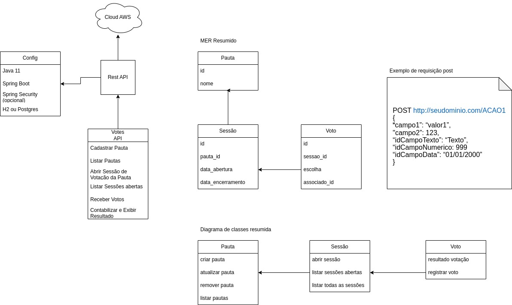

# Votes API

Serviço de criação de pautas para votação entre cooperados e associados.

## Tecnologias

- Java 11

- Spring Boot Web

- Spring Boot Data JPA

- Spring Boot Test

- Spring Boot Validator

- Spring Boot Actuator

- Apache Log4J

- Flyway migration

## Banco de Dados

- H2Database

## Arquitetura, padrões e afins

- Devido ao escopo da aplicação e sua provável demanda, definimos que a arquitetura da aplicação deve seguir os conceitos definidos e conhecidos como Port and Adapters ou Arquitetura Hexagonal seguindo a definição de isolarmos a camada de negócio das tecnologias e relacionados que podem e provavelmente sofrerão alterações no futuro, o que é esperado para a maior parte das aplicações atuais.

- O princípio de responsabilidade única foi utilizado para orientar o desenvolvimento das features.

- O projeto foi desenvolvido e disponibilizado seguindo a estratégia de fluxo de trabalho proposto pelo Git Flow.

- Inicialmente o projeto foi construído para persistir utilizando Postgres como banco de dados, entretanto essa decisão foi alterada para H2 dado o escopo atual que visa testar a aplicação sem maiore dificuldades, porém, para utilizarmos o Postgres ou outro sgbd, basta alterarmos as propriedades da aplicação apontando para novo banco de dados e adequar o migration no que for necessário, sem maiores impactos.

## Estrutura de Pastas

- Arquitetura hexagonal ou Ports and Adapters

```
.
|-- data
|-- src
    |-- main
    |   |-- java
    |   |   `-- com.abnegmf.votesapi
    |   |       |-- application
    |   |           `-- adapters
    |   |               |-- controller
    |   |                   |-- form
    |   |               |-- converter
    |   |           `-- error
    |   |           `-- util
    |   |       |-- domain
    |   |           `-- adapters
    |   |               |-- services
    |   |           `-- dtos
    |   |           `-- ports
    |   |               |-- interfaces
    |   |               |-- repositories
    |   |       |-- infrastructure
    |   |           `-- adapters
    |   |               |-- converter
    |   |               |-- entities
    |   |               |-- repositories
    |   |           `-- config
    |   `-- resources
    |       `-- db
    |       `   `-- migration
    |
    |-- test
    |   |-- java
    |   |   `-- com.abnegmf.votesapi
    |   |       |-- application
    |   |           `-- adapters
    |   |               |-- controller
    |   |               |-- converter
    |   |       |-- domain
    |   |           `-- adapters
    |   |               |-- services
    |   |       |-- infrastructure
    |   |           `-- adapters
    |   |               |-- converter
    |   |               |-- repositories
    |   |       |-- utils
```

## Endpoints

#### Pauta

Criar Pauta
```http
  POST /pautas
```

  | Body Field | Type     | Description                |
  | :-------- | :------- | :------------------------- |
  | `nome` | `string` | **Obrigatório**. Nome da pauta para votação |

- `Exemplo curl`
 
```bash
curl --location --request POST 'http://localhost:8081/pautas' \
--header 'Content-Type: application/json' \
--header 'Cookie: JSESSIONID=510F29D62595036E09B9E350471D3B97' \
--data-raw '{
    "nome": "Pauta Teste"
}'
```

Alterar Pauta
```http
  PUT /pautas/{id}
```
  | Parameter | Type     | Description                |
  | :-------- | :------- | :------------------------- |
  | `id` | `integer` | **Obrigatório**. Id da pauta a ser alterada. |
  
  | Body Field | Type     | Description                |
  | :-------- | :------- | :------------------------- |
  | `nome` | `string` | **Obrigatório**. Nome da pauta para votação. |

- `Exemplo curl`
 
```bash
curl --location --request PUT 'http://localhost:8081/pautas/1' \
--header 'Content-Type: application/json' \
--header 'Cookie: JSESSIONID=510F29D62595036E09B9E350471D3B97' \
--data-raw '{
    "nome": "Alterando pauta de teste"
}'
```

Remover Pauta
```http
  DELETE /pautas/{id}
```

  | Parameter | Type     | Description                |
  | :-------- | :------- | :------------------------- |
  | `id` | `string` | **Obrigatório**. Id da pauta a ser removida |

- `Exemplo curl`
 
```bash
curl --location --request DELETE 'http://localhost:8081/pautas/1' \
--header 'Content-Type: application/json' \
--header 'Cookie: JSESSIONID=510F29D62595036E09B9E350471D3B97'
```

Listar Pautas
```http
  GET /pautas
```

- `Exemplo curl`
 
```bash
curl --location --request GET 'http://localhost:8081/pautas' \
--header 'Content-Type: application/json' \
--header 'Cookie: JSESSIONID=510F29D62595036E09B9E350471D3B97' \
--data-raw ''
```

#### Sessão

Abrir sessão
```http
  POST /sessao
```

  | Body Field | Type     | Description                | Default |
  | :-------- | :------- | :------------------------- | :------------------------- |
  | `pautaId` | `integer` | **Obrigatório**. Id da pauta cuja sessão de votos será aberta. | none |
  | `dataEncerramento` | `string` | **Opcional**. Data de encerramento da sessão em formato 'dd/MM/yyyy hh:MM:ss'.| Data e hora atual com acréscimo de um minuto.|

- `Exemplo curl`
 
```bash
curl --location --request POST 'http://localhost:8081/sessao' \
--header 'Content-Type: application/json' \
--header 'Cookie: JSESSIONID=510F29D62595036E09B9E350471D3B97' \
--data-raw '{
    "pautaId": 1,
    "dataEncerramento": "23/01/2023 19:00:00"
}'
```

Listar sessões ativas
```http
  GET /sessao/listar-ativas
```

- `Exemplo curl`
 
```bash
curl --location --request GET 'http://localhost:8081/sessao/listar-ativas' \
--header 'Content-Type: application/json' \
--header 'Cookie: JSESSIONID=510F29D62595036E09B9E350471D3B97' \
--data-raw ''
```

Listar todas as sessões
```http
  GET /sessao
```

- `Exemplo curl`
 
```bash
curl --location --request GET 'http://localhost:8081/sessao' \
--header 'Content-Type: application/json' \
--header 'Cookie: JSESSIONID=510F29D62595036E09B9E350471D3B97' \
--data-raw ''
```

#### Votação

Registrar voto
```http
  POST /votacao/registrar-voto
```

  | Body Field | Type     | Description                | Default |
  | :-------- | :------- | :------------------------- | :------------------------- |
  | `sessaoId` | `integer` | **Obrigatório**. Id da sessão aberta para votação. | none |
  | `associadoId` | `integer` | **Obrigatório**. Id do associado que fará registrará o voto.|
  | `escolha` | `string(1)` | **Obrigatório**. Voto a ser escolhido pelo associado, sendo 'S' para sim e 'N' para não.|

- `Exemplo curl`
 
```bash
curl --location --request POST 'http://localhost:8081/votacao/registrar-voto' \
--header 'Content-Type: application/json' \
--header 'Cookie: JSESSIONID=510F29D62595036E09B9E350471D3B97' \
--data-raw '{
    "sessaoId": 1,
    "associadoId": 3,
    "escolha": "S"
}'
```

Resultado votação
```http
  POST /votacao/resultado/sessao=3
```

  | Parameter | Type     | Description                | Default |
  | :-------- | :------- | :------------------------- | :------------------------- |
  | `sessaoId` | `integer` | **Obrigatório**. Id da sessão de votação. | none |


- `Exemplo curl`
 
```bash
curl --location --request GET 'http://localhost:8081/votacao/resultado/sessao=3' \
--header 'Content-Type: application/json' \
--header 'Cookie: JSESSIONID=510F29D62595036E09B9E350471D3B97' \
--data-raw ''
```

## Detalhamento dos campos da API

  | Field | Type     | Validação                | Obrigatório | Máximo de caracteres | Formato |
  | :-------- | :------- | :------------------------- | :------------------------- | :---------------- | :------------- |
  | `pautaId` | `integer` | Não deve ser NULL. | Sim | . | . |
  | `sessaoId` | `integer` | Não deve ser NULL. | Sim | . | . |
  | `associadoId` | `integer` | Não deve ser NULL. | Sim | . | . |
  | `nome` | `string` | Não deve ser NULL. Não deve ser vazio. | Sim | 150 | . |
  | `escolha` | `string` | Não deve ser NULL. Não deve ser vazio. Deve ser maiúsculo. | Sim | 1 | 'S' ou 'N' |
  | `dataEncerramento` | `string` | Não deve ser NULL. Não deve ser vazio. | Não | . | dd/MM/yyyy HH:mm:ss |
  


## Trabalhando com o projeto

#### Install
```bash
  ./mvnw clean install
```

#### Test
```bash
  ./mvnw test
```

#### Run
```bash
  ./mvnw spring-boot:start 
```

#### Stop
```bash
  ./mvnw spring-boot:stop
```

## Modelagem inicial

<span style="display:block;text-align:center"></span>

## Roadmap

- Definir o Callback das URLs de criação
- Dockerizar o ambiente
